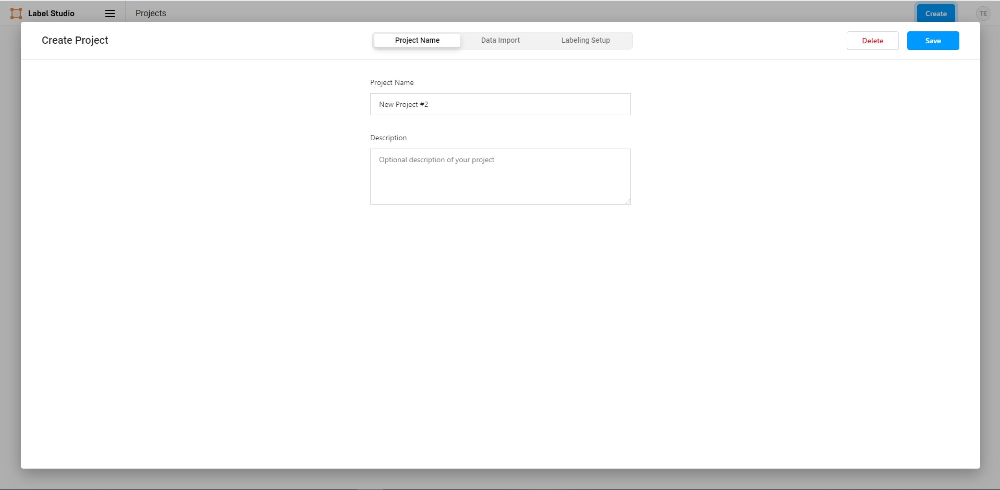
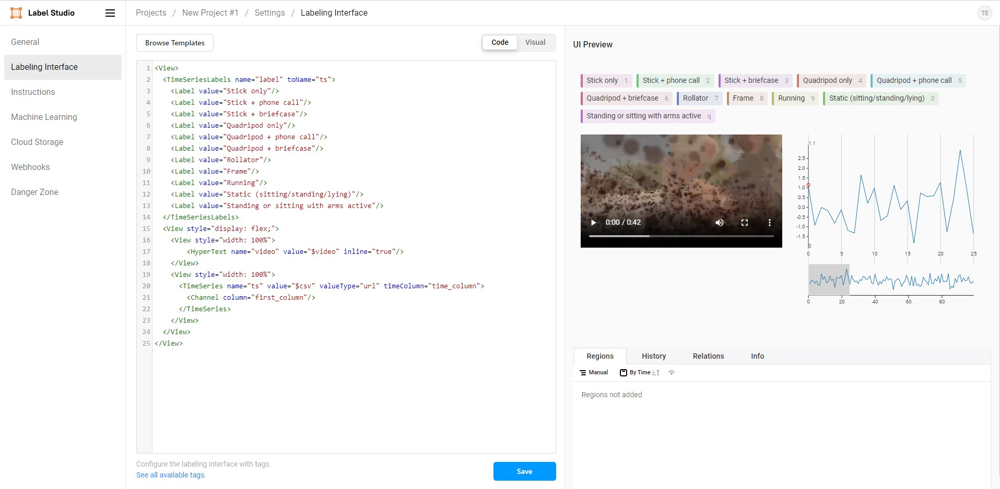
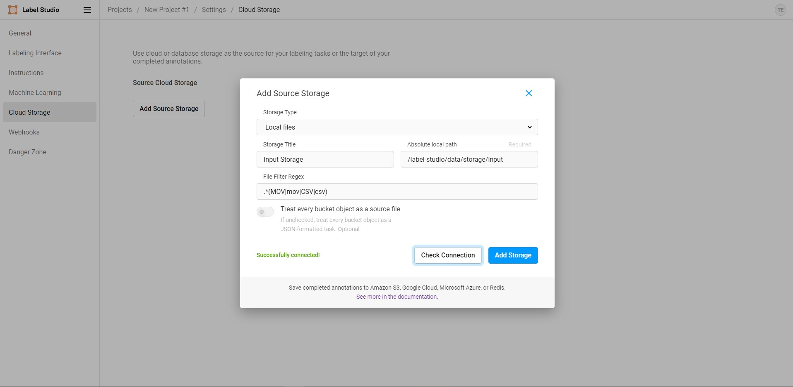
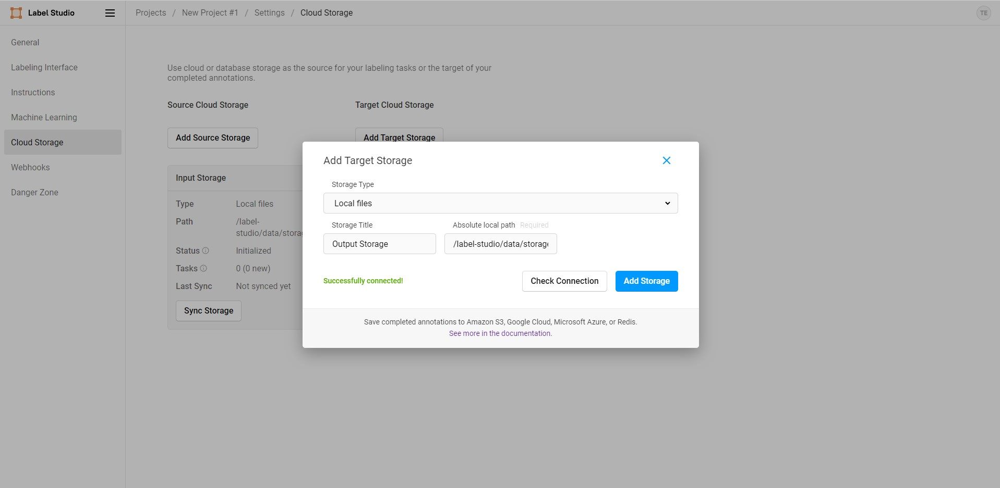
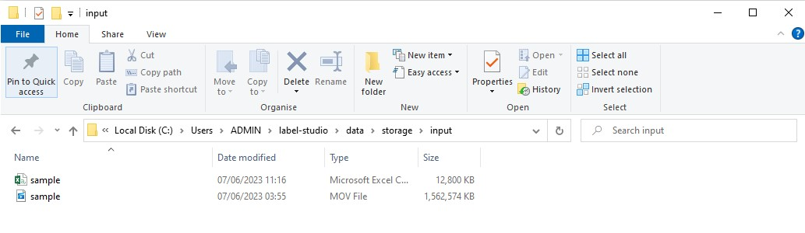
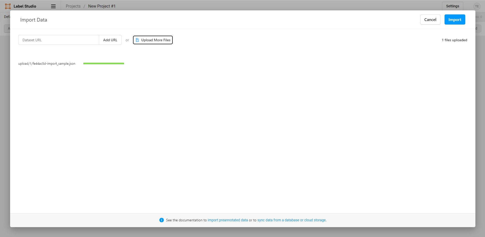

# Label studio guideline

## Docker installation

To be able to run label studio on your machine without any issues, you need to run it via Docker Desktop. This section provide guide on how to install Docker Desktop on your computer.

1. Navigate to this [link](https://www.docker.com/products/docker-desktop/) and press `Download Docker Desktop` to install Docker.


2. Wait for the download to finish and open the downloaded file. Continue with the default option.


3. When the installation is finished, you should see an `Installation succeed` message. You can now open Docker by opening Windows and type in `Docker`.


4. Open the app. Accept the term & conditions and skip the question


Now you have successfully installed Docker on your machine. We will now setup Label Studio so that you could perform your annotation.

## Setup label studio

### First time setup

1. Download the `setup-windows.bat` file in the `scripts` directory.

2. Double click the `setup-windows.bat` file to run the setup. It might take a couple of minutes for the installation to complete.

3. Verify that the command window show the message `App has been setup successfully`.


### Starting the app 

After you have run the `setup-windows.bat` file, you can access Label Studio at http://localhost:8080.
If you restart your machine, open Docker and the app will automatically start.


### Configure the project

After performing the setup, Label Studio can now be accessed via a browser at http://localhost:8080.

#### Create an account
1. Create a new account on the `Sign Up` panel
2. Login to the newly created account

#### Create a new project
To create a new project, click on the `Create Project` button in the app. Type in the project name and description, then click `Save`.




#### Setup labeling interface
To setup the labeling interface for the video/time-series annotation, perform the following steps:

1. Click on the newly created project.
2. Click on `Settings` at the top right corner.
3. Choose `Labeling Interface` menu option.
4. Paste in the following template, then click `Save`
```xml
<View>
  <TimeSeriesLabels name="label" toName="ts">
    <Label value="Stick only"/>
    <Label value="Stick + phone call"/>
    <Label value="Stick + briefcase"/>
    <Label value="Quadripod only"/>
    <Label value="Quadripod + phone call"/>
    <Label value="Quadripod + briefcase"/>
    <Label value="Rollator"/>
    <Label value="Frame"/>
    <Label value="Running"/>
    <Label value="Static (sitting/standing/lying)"/>
    <Label value="Standing or sitting with arms active"/>
  </TimeSeriesLabels>
  <View style="display: flex;">
    <View style="width: 100%">
        <HyperText name="video" value="$video" inline="true"/>
    </View>
    <View style="width: 100%">
      <TimeSeries name="ts" value="$csv" valueType="url" timeColumn="index">
        <Channel column="accel_x"/>
      </TimeSeries>
    </View>
  </View>
</View>
```




#### Add local storage
To add the directory to store your data, perform the following steps

1. Click on the newly created project.
2. Click on `Settings` at the top right corner.
3. Select the `Cloud Storage` menu item.
4. Click `Add Source Storage`.
5. Configure the **Source** storage with the following settings. Click `Check Connection` to confirm that the storage is valid, then click `Add Storage`. Then click `Sync Storage`.
    - Storage Type: `Local files`
    - Storage Title: `Input Storage`
    - Absolute local path: `/label-studio/data/storage/input`
    - File Filter Regex: `.*(MOV|mov|MP4|mp4|CSV|csv)`

6. Configure the **Target** storage with the following settings. Click `Check Connection` to confirm that the storage is valid, then click `Add Storage`.
    - Storage Type: `Local files`
    - Storage Title: `Output Storage`
    - Absolute local path: `/label-studio/data/storage/output`



### Annotation setup

#### Importing data
For each data annotation, you will need to prepare 2 files:
- a `.mp4` file: This file contains the video being recorded for annotation.
- a `.csv` file: This file contains the CWA time series data that correspond to the video. Note that the start and end of the CWA data must match the `mp4` video. The format of the csv file should be as following:
```
index,time,accel_x,accel_y,accel_z,temperature
0,2023-05-08 09:10:18.722778368,0.078125,0.546875,-1.1875,28.515625
1,2023-05-08 09:10:18.722778368,-0.0625,-0.03125,-1.0,28.515625
2,2023-05-08 09:10:18.722778368,-0.0625,-0.03125,-1.046875,28.515625
...
```

To import the data to the annotation tool, refer to the following steps:
1. Identify the source directory. It is located in the `label-studio` directory on your computer home directory. For example, on Windows, if you user is `username` then the directory would be located at `C:\Users\username\label-studio`.
2. Navigate to the input storage folder, which would be located in the `data\storage` directory. For the above example, it would be located at `C:\Users\username\label-studio\data\storage\input`.
3. Move the MP4 and the CSV file into this input storage folder.

4. Create an `import.json` file, which has the following content. Replace `$MP4_FILE_NAME$` with the name of your video file, and `$CSV_FILE_NAME$` with the name of your CSV file.
```
[
    {
        "csv": "/data/local-files/?d=storage/input/$CSV_FILE_NAME$",
        "video": "<video src='/data/local-files/?d=storage/input/$MP4_FILE_NAME$' width='100%' controls onloadeddata=\"setTimeout(function(){ts=Htx.annotationStore.selected.names.get('ts');t=ts.data.accel_x;v=document.getElementsByTagName('video')[0];w=parseInt(t.length*(5/v.duration));l=t.length-w;ts.updateTR([t[0], t[w]], 1.001);r=$=>
ts.brushRange.map(n=>(+n).toFixed(2));_=r();setInterval($=>r().some((n,i)=>n!==_[i])&&(_=r())&&(v.currentTime=v.duration*(r()[0]-t[0])/(t.slice(-1)[0]-t[0]-(r()[1]-r()[0]))),300); console.log('video is loaded, starting to sync with time series')}, 3000); \" />"
    }
]
```


5. Navigate to the project. Click `Import` and select the above `import.json` file. Click `Import`.
6. You will be directed to the task list screen. Click on the newly created task. You can see the labeling command that has the video and the signal.
7. (*Important*) Wait for the video to fully load. This ensures that the time from the signal is matched.

#### Performing annotation

##### Navigating between tasks

##### Synchronizing time-series and video

##### Segmentation annotation

### Uninstalling the app

To fully uninstall the app, you can either (1) Uninstall docker or (2) uninstall the label studio app in Docker

#### Uninstalling Docker
Simply remove Docker with Windows App Manager or equivilant tools in other Operating System.

#### Uninstalling Label Studio

1. Open Docker.
2. Navigate to the `Containers` menu.
3. Click on the `label_studio` app.
4. Click on the delete icon on the top right of the Windows.
5. Navigate to the `Images` menu.
6. Click on the `heartexlabs/label-studio` image.
7. Click on the delete icon on the top right of the Windows.


### Troubleshooting
#### Running label studio for the first time
If you have trouble running label studio for the first time with the `setup-windows.bat` file, try to run the following command in CMD instead

```bash
LOCAL_STORAGE_PATH=C:\\label-studio\\storage
docker run \
-e LABEL_STUDIO_LOCAL_FILES_SERVING_ENABLED=true \
-e LABEL_STUDIO_LOCAL_FILES_DOCUMENT_ROOT=$LOCAL_STORAGE_PATH \
-it -p 8080:8080 \
-v $LOCAL_STORAGE_PATH:/label-studio/data heartexlabs/label-studio:latest \
label-studio \
--log-level DEBUG
```