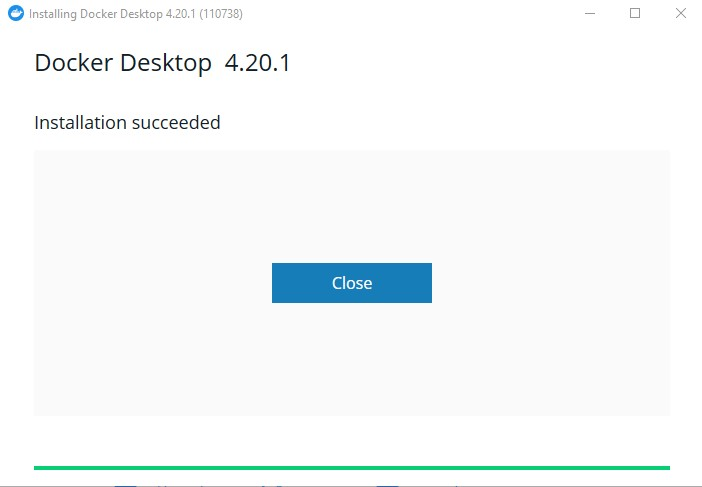

# Label studio guideline

## Docker installation

To be able to run label studio on your machine without any issues, you need to run it via Docker Desktop. This section provide guide on how to install Docker Desktop on your computer.

1. Navigate to this [link](https://www.docker.com/products/docker-desktop/) and press `Download Docker Desktop` to install Docker.


2. Wait for the download to finish and open the downloaded file. Continue with the default option.


3. When the installation is finished, you should see an `Installation succeed` message. You can now open Docker by opening Windows and type in `Docker`.




4. Open the app. Accept the term & conditions and skip the question


Now you have successfully installed Docker on your machine. We will now setup Label Studio so that you could perform your annotation.

## Setup label studio

### First time setup

#### Windows

1. Navigate to the `setup-windows.bat` file in the `scripts` directory.

2. Double click the `setup-windows.bat` file to run the setup. It might take a couple of minutes for the installation to complete.

3. Verify that the command window show the message `App has been setup successfully`.

#### MacOS or Linux

1. Navigate to the `setup.sh` file in the `scripts` directory.

2. Open the terminal and access the `scripts` directory. For example, if you extract the app at `Downloads`, then type the following commands in the terminal, then press enter
```bash
cd ~/Downloads/label-studio-setup/scripts
chmod +x setup.sh
bash setup.sh
```

3. Verify that the command window show the message `App has been setup successfully`.


### Starting the app 

After you have run the `setup-windows.bat` file, you can access Label Studio at http://localhost:8080.
If you restart your machine, open Docker and the app will automatically start.


### Configure the project

After performing the setup, Label Studio can now be accessed via a browser at http://localhost:8080. You can create a new account, or login with this default credential
```
Username: upwatcher@gmail.com
Password: upwatch
```

### Annotation setup
- In order to update the labelling configuration, we need to update [convert-tool/src/ls_client.py](./convert-tool/src/ls_client.py).
- The labelling configuration are stored in two variables: `MATCHING_LABEL_CONFIG` and `CLASSIFY_LABEL_CONFIG`. You can update those files according to the [Label Studio official guide](https://labelstud.io/tags/)

#### Importing data
To import the data, refer to the following step to use the data convert tool to create import files for the annotation tool. You can access the data convert tool at [http://localhost:5000](http://localhost:5000)

##### Upload CWA and MOV file to convert tool
1. Access the data convert tool at [http://localhost:5000](http://localhost:5000).
2. Select the MOV file and CWA file of sensor 1 and sensor 2
3. Press `Upload` to upload the files


##### Select the time segment for annotation
Since CWA file contains signals that were recorded in a long time duration, you can select the start and end point to perform annotation. After uploading the files, you will be prompted to select the time start and time end for the two sensors. 

1. Select the Start and End time for the first sensor
2. Select the Start and End time for the second sensor
3. Press `Create import files`. If the files are large, it should take a while to process, so be patience and do not close the browser. Typically, a 1GB data would take about 10-15 minutes to process.


##### Download the import files and import to label studio
Follow the instruction provided in the import tool to import the data to Label Studio


#### Performing annotation

##### Navigating between tasks

Go to project list and click on the project you have created. You will see a list of tasks that you have created (If you import 1 task then there would be only 1 task available). Click on the task you would like to annotate


You will be redirected to a screen that has a video and a time series signal. **Make sure to wait for the video to load, so that the time in video and time in time series signal can be synchronized**


##### Annotation process

On the right hand side of the annotating panel, you can notice there is a time series signal being diplayed. Notice the small panel underneath. You can navigate on where to display the signal, and the video will auto adjust the time correspondingly. You can also adjust the window size, but it's recommended that you keep it small and navigating it *slowly* from left to right so the video could load easily. 

See [this video](assets/15-annotation-steps.avi) for more detail instruction of the annotation process.

**Note**
- **Press play only once in the first time, then use the right panel to navigate**. Wait for a few seconds and the video will autoplay.
- **Do not use the control of the video** on the left side, since it would not synchronize the corresponding signal


##### Exporting data
To export data, navigate to the project dashboard. Select the task you would like to export, and press the `Export` button. Then select the data format and press `Export` to download the annotated data.

See [this video](assets/16-export-data.avi) for the instruction.

### Uninstalling the app

To fully uninstall the app, you can either (1) Uninstall docker or (2) uninstall the label studio app in Docker

#### Uninstalling Docker
Simply remove Docker with Windows App Manager or equivilant tools in other Operating System.

#### Uninstalling Label Studio

1. Open Docker.
2. Navigate to the `Containers` menu.
3. Click on the `label_studio` app.
4. Click on the delete icon on the top right of the Windows.
5. Navigate to the `Images` menu.
6. Click on the `heartexlabs/label-studio` image.
7. Click on the delete icon on the top right of the Windows.


### Troubleshooting
#### Running label studio for the first time
If you have trouble running label studio for the first time with the `setup-windows.bat` file, try to run the following command in CMD instead

```bash
LOCAL_STORAGE_PATH=C:\\label-studio\\storage
docker run \
-e LABEL_STUDIO_LOCAL_FILES_SERVING_ENABLED=true \
-e LABEL_STUDIO_LOCAL_FILES_DOCUMENT_ROOT=$LOCAL_STORAGE_PATH \
-it -p 8080:8080 \
-v $LOCAL_STORAGE_PATH:/label-studio/data heartexlabs/label-studio:latest \
label-studio \
--log-level DEBUG
```